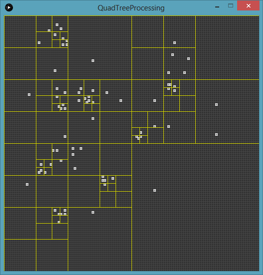
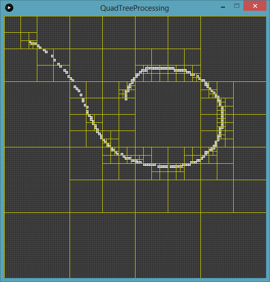

# quadtree-processing

[Processing](https://processing.org/) project for 

* [QuadTree](#quadtree-processing) simulation ([examples](#all-examples))

## Dependencies

All dependencies of this project are native to Processing platform.

## Contact / License

Feel free to contact me by mail: guilherme.farto@gmail.com

---

<a name="quadtree-processing"></a>
## QuadTree (QuadTreeProcessing.pde)
> Based on [QuadTree](https://en.wikipedia.org/wiki/Quadtree) data structure - a two-dimensional tree data structure in which each internal node has exactly four children

Usage:

`Open the main .pde file (QuadTreeProcessing.pde) and run it by the Processing IDE`
* Pressing <kbd>CTRL</kbd>+<kbd>R</kbd>; or
* Selecting menu <kbd>Sketch</kbd> and <kbd>Run</kbd>;

### Main concepts of QuadTree data structure (introduction and concepts)

asdf

### Classes of QuadTree implementation

* **Object.pde**

> Class that represents the object entity.

A object is a item with a position `(x, y)` and a `value` attribute.

The attributes for Object class are:
  
```java
  int value
  int x
  int y
```

The methods for Object class are:

```java
  void draw(color colorForQuad) { ... }
  
  void log() { ... }
```

* **QuadTree.pde**

> Class that represents the QuadTree entity.

The QuadTree class is responsible for all features and implementations based on the concepts of the QuadTree data structure.

The attributes for QuadTree class are:
  
```java
  ArrayList<Object> objects = new ArrayList<Object>()

  int x
  int y
  int width
  int height

  int level 
  int maxObjects
  int maxLevels

  color randomColorForObjects

  QuadTree nw, ne, sw, se
  HashMap<Integer, QuadTree> quads = new HashMap<Integer, QuadTree>()
```

The methods for QuadTree class are:

```java
  boolean addObject(Object object) { ... }
  boolean exchangeObjectsToQuads() { ... }
  boolean removeObject(Object object) { ... }
  boolean clear() { ... }
  int getQuadIndex(Object object) { ... }
  boolean split() { ... }
  
  void draw() { ... }
  void drawObjects() { ... }
  
  void simulate(QuadTree root, int scale, int maxLevels) { ... }
  
  void loadData(int[][] data) { ... }
  
  void log() { ... }
```

* **QuadTreeProcessing.pde**

> Main class that represents the integration of all entities (Object and QuadTree) of the QuadTree context.

The attributes for QuadTreeProcessing class are:
  
```java
  final int DEFAULT_SCALE = 4
  final int MAX_OBJECTS = 4

  int MAX_LEVELS
  int RANDOM_OBJECTS

  int rows, cols
  int[][] data

  QuadTree root = null
  
  boolean simulateQuadTrees = false
```

The methods for QuadTreeProcessing class are:

```java
  void init() { ... }
  
  void setup() { ... }
  void draw() { ... }
  
  void drawGrid() { ... }
  void generateRandomObjects() { ... }
  
  void keyPressed() { ... }
  void mousePressed() { ... }
  void mouseDragged() { ... }
  
  boolean hasObject(int rowId, int colId) { ... }
  int getSelectedRow(int mouseY) { ... }
  int getSelectedCol(int mouseX) { ... }
```

<a name="quadtree-instructions"></a>
## Instructions for QuadTree simulation (keyboard and mouse commands)

asdf

| Type          | Command             | Description                               |
| ------------- | ------------------- | ----------------------------------------- |
| `Keyboard`    | Press <kbd>C</kbd>  | Clear the simulation                      |
| `Keyboard`    | Press <kbd>R</kbd>  | Generate random objects                   |
| `Keyboard`    | Press <kbd>F2</kbd> | Show or hide (simulate) QuadTrees         |
| `Mouse`       | `Left`-click        | Create an object at `(x, y)` mouse event  |

<a name="all-examples"></a>
## Examples

<a name="quadtree-examples-1"></a>
### > Interacting with QuadTree simulation features

| quadtree_1.png           | quadtree_2.png           |
| ------------------------ | ------------------------ |
|  |  |

<a name="quadtree-examples-2"></a>
### > Generating random objects for QuadTree simulation

| quadtree-random_1.png     |
| ------------------------ |
|  |
